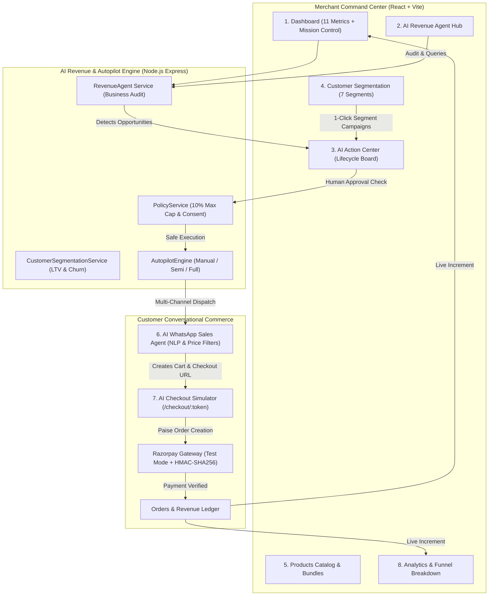
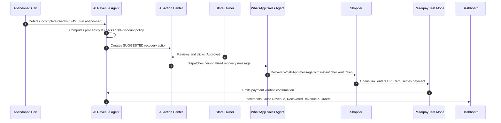

# 🚀 RazorAgent — AI Revenue Autopilot

[](LICENSE)
[](https://nodejs.org)
[](https://react.dev)
[](https://vitejs.dev)
[](https://tailwindcss.com)
[](https://razorpay.com)
[](backend/tests)
[](frontend)

> **An AI Revenue Employee for Agentic Commerce and Autonomous Growth.**  
> Built for the **Razorpay AI Growth & Agentic Commerce Buildathon**.

---

## 💡 The Product Goal

Most e-commerce tools are either passive dashboards or generic chatbots. **RazorAgent** is fundamentally different — it acts as an **autonomous AI revenue employee** that drives bottom-line merchant growth through a continuous intelligence loop:

$$\mathbf{Understand\ Business\ Data} \longrightarrow \mathbf{Find\ Revenue\ Opportunities} \longrightarrow \mathbf{Recommend\ Actions} \longrightarrow \mathbf{Execute\ Approved\ Actions} \longrightarrow \mathbf{Track\ Revenue\ Impact}$$

---

## 📑 Table of Contents

- [The 8 Core Pages & Navigation](#-the-8-core-pages--navigation)
- [System Architecture](#-system-architecture)
- [The 7 Core Features](#-the-7-core-features)
  - [1. AI Revenue Agent](#1-ai-revenue-agent)
  - [2. AI Action Center](#2-ai-action-center)
  - [3. AI Customer Segmentation](#3-ai-customer-segmentation)
  - [4. AI WhatsApp Sales Agent](#4-ai-whatsapp-sales-agent)
  - [5. AI Checkout + Revenue Tracking](#5-ai-checkout--revenue-tracking)
  - [6. Abandoned Cart Recovery Loop](#6-abandoned-cart-recovery-loop)
  - [7. Revenue Dashboard & Analytics](#7-revenue-dashboard--analytics)
- [Autonomous Autopilot Engine](#-autonomous-autopilot-engine)
- [Live 8-Step Demo Script](#-live-8-step-demo-script)
- [API Reference](#-api-reference)
- [Quick Start Guide](#-quick-start-guide)
- [Automated Testing Suite](#-automated-testing-suite)
- [Tech Stack](#-tech-stack)
- [Security & Guardrails](#-security--guardrails)
- [License](#-license)

---

## 🧭 The 8 Core Pages & Navigation

The platform is organized into 8 prominent, dedicated core pages accessible from the persistent sidebar navigation:

| # | Core Page | Route | Description |
|---|---|---|---|
| 1 | **Dashboard** | `/` | 11 Core Metrics, 3 AI Insight Feed cards, ₹18,500 Potential Revenue Detected banner, and Autopilot Mission Control. |
| 2 | **AI Revenue Agent** | `/ai-agent` | Natural language business queries (*"How can I increase my revenue this week?"*), opportunity detection cards, telemetry chips, and 1-click promotion to Action Center. |
| 3 | **AI Action Center** | `/action-center` | Central actions board with full lifecycle states (`Suggested` → `Approved` → `Executing` → `Completed`), priority levels, and human-in-the-loop review modal. |
| 4 | **Customers** | `/customers` | 7 AI Customer Segments (`New`, `Loyal`, `VIP`, `High-Value`, `At-Risk`, `Churned`, `High-Intent`), LTV calculations, and `[Create Segment Campaign]` launcher. |
| 5 | **Products** | `/products` | Inventory catalog management, stock depletion alerts, automated AOV bundle recommendations, and `[Add Product]` modal. |
| 6 | **WhatsApp Agent** | `/whatsapp-agent` | Conversational commerce smartphone simulator with catalog discovery, price filters (*"under ₹2,000"*), interactive product cards, `[Add to Cart]`, live cart pill, and checkout link. Includes a clearly labeled **Demo Mode**. |
| 7 | **Orders** | `/orders` | Real-time ledger of completed orders, auto-applied recovery discounts, and Razorpay Test Mode settlements. |
| 8 | **Analytics** | `/analytics` | Revenue leakage breakdown, 4-stage conversion funnel, WhatsApp Conversational Commerce ROI, and AOV trend graphs. |

---

## 🏗️ System Architecture



---

## ✨ The 7 Core Features

### 1. AI Revenue Agent
*Acts like an in-house Chief Revenue Officer analyzing store data 24/7.*
- **Multi-Dimensional Business Audit**: Continuously evaluates sales velocity, orders, products, customers, carts, AOV, conversion rates, and repeat purchases.
- **Structured Opportunity Schema**: Formulates proposals containing:
  - `id`: Unique opportunity tracking identifier.
  - `priority`: `High` | `Medium` | `Low`.
  - `title`: Clear business objective (e.g., *"Abandoned Cart Recovery Campaign"*).
  - `reason`: Root-cause diagnosis explaining why revenue is leaking.
  - `estimated_impact`: Projected revenue recovery in INR (e.g., ₹18,500).
  - `recommended_action`: Prescribed operational next step.
  - `channel`: Dispatch target (WhatsApp / Email / Storefront).
- **Merchant Query Handler**: Answers complex merchant questions like:
  - *"How can I increase my revenue this week?"* $
ightarrow$ Outlines abandoned cart recovery strategies.
  - *"Why did sales drop yesterday?"* $
ightarrow$ Identifies dropoff bottlenecks at checkout.
  - *"Show me VIP customer opportunities"* $
ightarrow$ Formulates exclusive preview catalog drops.
- **Direct Opportunity Promotion**: 1-click button promotes any opportunity directly into the **AI Action Center** as a suggested action.

---

### 2. AI Action Center
*The mission control board where recommendations become executed campaigns.*
- **Complete Action Lifecycle**:
  $$	ext{Suggested} longrightarrow 	ext{Approved} longrightarrow 	ext{Executing} longrightarrow 	ext{Completed}$$
  *(Supports `Rejected`, `Failed`, and `Cancelled` states with reason tracking)*
- **Human-in-the-Loop Safeguard**: Automated actions remain in `Suggested` state until the merchant reviews and explicitly clicks `[Approve]`.
- **Card Telemetry**: Shows target customer count, estimated financial impact, delivery channel, priority badge, and date created.
- **Review Modal**: View complete payload, targeted customer list, discount parameters, and approve or reject with one click.

---

### 3. AI Customer Segmentation
*Autonomous customer intelligence categorizing buyers into 7 actionable cohorts.*
- **The 7 Segments**:
  1. 🌟 **VIP Customers**: High-frequency shoppers with Lifetime Value (LTV) $ge$ ₹15,000.
  2. 💎 **Loyal Customers**: Steady buyers with 3+ completed store orders.
  3. 🛍️ **High-Value Customers**: Shoppers with large single-order cart sizes ($ge$ ₹2,500).
  4. 🆕 **New Customers**: First-time visitors and recent account signups.
  5. ⚠️ **At-Risk Customers**: Past buyers showing slowing velocity ($40+$ days without an order).
  6. 💤 **Churned Customers**: Dormant buyers inactive for $90+$ days.
  7. 🔥 **High-Intent Customers**: Shoppers with active or abandoned shopping carts.
- **Cohort Metrics**: Displays total orders, gross spent, last purchase date, segment badge, and computed LTV.
- **1-Click Segment Campaigns**: Click `[Create Campaign]` on any segment to launch a tailored WhatsApp/Email recovery action directly into the AI Action Center.

---

### 4. AI WhatsApp Sales Agent
*A customer-facing sales rep that converts conversational intent into paid checkouts.*
- **Conversational Product Discovery**: Answers questions naturally (*"What audio gear do you have?"*, *"Show me gym accessories"*).
- **Price Cap Filtering**: Understands price limit constraints (*"Show me products under ₹2,000"* or *"below 1500"*).
- **Interactive Product Cards**: Displays image, title, price, feature bullet points, and an active `[Add to Cart]` button.
- **Live Cart Badge & Instant Checkout**: Automatically creates active backend cart sessions and delivers one-click checkout URLs (`/checkout/:token`).
- **Interactive Demo WhatsApp Simulator**: Integrated smartphone UI with simulated quick-reply buttons and a clearly labeled **Demo Mode** toggle.

---

### 5. AI Checkout + Revenue Tracking
*Frictionless checkout experience with Razorpay Test Mode integration.*
- **Complete Commerce Pipeline**:
  $$	ext{Discovery} longrightarrow 	ext{Recommendation} longrightarrow 	ext{Add to Cart} longrightarrow 	ext{Checkout} longrightarrow 	ext{Razorpay Payment} longrightarrow 	ext{Confirmation}$$
- **Exact Paise Math**: Clean INR paise currency handling (`Math.round(amount * 100)`).
- **Cryptographic Signature Verification**: HMAC-SHA256 signature verifier ensures authentic payment confirmation.
- **Real-Time Revenue Telemetry**: Every successful payment immediately increments:
  - Gross Revenue on the Dashboard and Analytics
  - Recovered Revenue salvaged by AI interventions
  - Total Converted Orders in the order ledger

---

### 6. Abandoned Cart Recovery Loop
*End-to-end automated recovery pipeline that recaptures lost sales.*


---

### 7. Revenue Dashboard & Analytics
*Comprehensive executive dashboard giving merchants total visibility into store health.*
- **11 Core Metrics**:
  1. **Gross Revenue (₹)**: Total store revenue across all completed checkouts.
  2. **Revenue Today (₹)**: Real-time intraday revenue velocity.
  3. **Revenue This Month (₹)**: Month-to-date sales aggregate.
  4. **Revenue Growth (%)**: Month-over-month growth rate indicator.
  5. **Total Orders**: All settled transactions across store.
  6. **Average Order Value (AOV)**: Mean value per transaction (boosted by bundles).
  7. **Conversion Rate (%)**: Percentage of checkout sessions converting to paid orders.
  8. **Repeat Customer Rate (%)**: Percentage of buyers with multiple orders.
  9. **Revenue At Risk (₹)**: Capital currently stuck in abandoned carts and dormant segments.
  10. **Potential Revenue Detected (₹)**: High-propensity recovery opportunity (highlighted in prominent top banner).
  11. **Recovered Revenue (₹)**: Net revenue salvaged directly by AI Autopilot campaigns.
- **3 AI Insight Feeds**:
  - 🔴 **Revenue Drop Detected**: Early warnings on checkout drop-off spikes.
  - 🟢 **Revenue Opportunity**: Real-time alerts on abandoned cart recovery pools.
  - 🔵 **AI Action Completed**: Confirmation of revenue salvaged via AI interventions.
- **Analytics Visualizer**:
  - **Revenue Leakage Visualizer**: Visual progress bars breaking down lost revenue across Abandoned Carts, Dormant Segments, and Unreached VIPs.
  - **4-Stage E-Commerce Funnel**: Storefront Visitors $
ightarrow$ Added to Cart $
ightarrow$ Initiated Checkout $
ightarrow$ Paid Orders.
  - **WhatsApp Commerce ROI**: Conversations handled, carts created via chat, and conversational revenue.

---

## 🎛️ Autonomous Autopilot Engine

Integrated directly into the Dashboard via **Autopilot Mission Control**:
- **Radar Pulse Status Beacon**: Glowing indicator pulsing green in Full Autopilot, cyan in Semi-Autopilot, and amber when paused.
- **3 Operational Modes**:
  - `MANUAL_ASSIST`: AI drafts recommendations; all actions require human approval in the Action Center.
  - `SEMI_AUTOPILOT` *(Recommended)*: Automatically executes safe, high-confidence recoveries ($ge 80\%$ confidence, $le 10\%$ discount); holds outliers for review.
  - `FULL_AUTOPILOT`: Fully hands-free 24/7 autonomous recovery within policy guardrails.
- **Emergency Pause / Resume**: Instantly halts all automated dispatches with a single toggle.
- **Live Activity Stream**: Real-time terminal streaming autonomous cycles and dispatch events.

---

## 🎬 Live 8-Step Demo Script

Follow this 2-minute walkthrough to experience the entire agentic loop:

1. **Dashboard Overview**: Open [http://localhost:5173](http://localhost:5173). View the 11 metrics, the 3 AI Insight cards, and the top banner: *"₹18,500 Potential Revenue Detected"*.
2. **AI Revenue Agent**: Navigate to `/ai-agent`. Click the chip *"How can I increase my revenue this week?"*. Read the AI analysis and click `[Promote to Action Center]`.
3. **AI Action Center**: Navigate to `/action-center`. Inspect the newly created `Suggested` action. Click `[Review]`, inspect target customers, and click `[Approve Action]`. Status transitions to `Approved`.
4. **Customer Segmentation**: Navigate to `/customers`. Explore the 7 segment tabs (`VIP`, `Loyal`, `At-Risk`, etc.). Click `[Create Campaign]` on At-Risk customers.
5. **Products Catalog**: Navigate to `/products`. View stock telemetry, price margins, and the Smart AOV Bundle card.
6. **WhatsApp Sales Agent**: Navigate to `/whatsapp-agent`. In the smartphone simulator:
   - Type *"Hi, what audio products do you have under 3500?"* $
ightarrow$ Agent suggests *Wireless ANC Headphones Pro*.
   - Click `[Add to Cart]` on the product card $
ightarrow$ Cart updates to ₹2,999.
   - Type *"checkout now"* $
ightarrow$ Agent delivers an instant recovery checkout link.
7. **Complete Checkout & Payment**: Click the checkout link. Review the cart and click `[Pay with Razorpay Test Mode]` (or test cards). Complete the test payment.
8. **Verify Revenue Increment**: Return to Dashboard (`/`) or Analytics (`/analytics`). Observe that **Gross Revenue**, **Recovered Revenue**, and **Total Orders** have automatically incremented!

---

## 📡 API Reference

All merchant endpoints require JWT authentication (`Authorization: Bearer <token>`).

### Authentication & Merchant
| Endpoint | Method | Description |
|---|---|---|
| `/api/auth/login` | POST | Authenticates merchant and issues JWT. |
| `/api/auth/register` | POST | Registers new store and default policy guardrails. |
| `/api/merchant/policies` | GET / PUT | Manages discount limits, budgets, and approval flags. |

### Analytics & Intelligence
| Endpoint | Method | Description |
|---|---|---|
| `/api/analytics` | GET | Returns 11 core metrics, 3 AI insights, and revenue trends. |
| `/api/analytics/revenue` | GET | Returns daily revenue velocity and chart telemetry. |
| `/api/analytics/checkout`| GET | Returns checkout dropoff rates and recovery statistics. |

### AI Revenue Agent & Action Center
| Endpoint | Method | Description |
|---|---|---|
| `/api/autopilot/revenue-analysis` | GET / POST | Multi-dimensional store audit & natural language query answering. |
| `/api/autopilot/revenue-agent-query`| POST | Direct prompt interface for the AI Revenue Agent. |
| `/api/autopilot/promote-opportunity`| POST | Converts opportunity into a live suggested action. |
| `/api/autopilot/actions` | GET / POST | Retrieves actions board or creates custom campaign action. |
| `/api/autopilot/actions/:id/approve`| POST | Merchant approval transition (`Suggested` → `Approved`). |
| `/api/autopilot/actions/:id/reject` | POST | Merchant rejection with reason logging. |
| `/api/autopilot/settings` | GET / POST | Manages Autopilot operational mode, threshold, and pause state. |
| `/api/autopilot/trigger-cycle` | POST | Triggers an immediate autonomous scan & dispatch cycle. |

### Customers & Catalog
| Endpoint | Method | Description |
|---|---|---|
| `/api/customers` | GET | Retrieves customers classified across 7 cohorts with LTV. |
| `/api/customers/campaign` | POST | Generates segment winback action in Action Center. |
| `/api/catalog/products` | GET / POST | Catalog inventory items and pricing. |

### Conversational Commerce & Checkout
| Endpoint | Method | Description |
|---|---|---|
| `/api/whatsapp/sales-message` | POST | Customer WhatsApp message handler (NLP, price filter, cart, checkout). |
| `/api/checkout/cart/:token` | GET | Public recovery checkout data by unique recovery token. |
| `/api/checkout/create-order` | POST | Generates Razorpay Test Mode order with paise calculation. |
| `/api/checkout/verify-payment` | POST | Verifies HMAC-SHA256 signature and settles payment. |

---

## ⚡ Quick Start Guide

### Prerequisites
- [Node.js](https://nodejs.org) v18 or higher (tested on Node.js v22)
- npm v9+

### 1. Clone & Install
```bash
git clone https://github.com/Vedansh5674/RazorAgent.git
cd RazorAgent

# Install root, backend, and frontend dependencies
npm run install:all
```

### 2. Environment Configuration
Backend comes pre-configured with zero-dependency embedded defaults in `backend/.env.example`:
```bash
cp backend/.env.example backend/.env
```

### 3. Start Development Servers
```bash
# Launches Backend (:5000) and Frontend (:5173) with auto-reload
npm run dev
```

- **Merchant Portal**: [http://localhost:5173](http://localhost:5173)
- **Backend API**: [http://localhost:5000](http://localhost:5000)

### 4. Default Demo Credentials
- **Email**: `admin@trendvault.in`
- **Password**: `DemoAdmin123!`

---

## 🧪 Automated Testing Suite

The repository includes a comprehensive test suite covering all 14 architectural components using Node.js's native test runner (`node:test`):

```bash
cd backend
npm test
```

### Test Results:
```
TAP version 13
# tests 68
# suites 1
# pass 68
# fail 0
# cancelled 0
# skipped 0
# todo 0
```

- ✅ `AIService Structured Output & Guardrails Suite`
- ✅ `AuditService Suite`
- ✅ `Auth & Security Suite`
- ✅ `AutopilotEngine Autonomous Recovery Suite`
- ✅ `AI Chatbot & Support Issue Resolution Suite`
- ✅ `CustomerSegmentationService Suite`
- ✅ `Abandoned Checkout Detection & Scan Suite`
- ✅ `Email Communications & Transactional Messages Suite`
- ✅ `PolicyService Guardrails Suite`
- ✅ `RazorpayService Test Mode Suite`
- ✅ `RevenueAgent Intelligence Suite`
- ✅ `TaskAgent User Requirements & Multi-Step Execution Suite`
- ✅ `WhatsAppService Suite`
- ✅ `WhatsAppSalesAgent Conversational Commerce Suite`

---

## 💻 Tech Stack

| Layer | Technology | Purpose |
|---|---|---|
| **Frontend** | React 18, Vite, Tailwind CSS, Lucide React, Recharts | Fast, responsive merchant dashboard & smartphone simulator. |
| **Backend** | Node.js (ESM), Express.js | High-throughput REST API & agentic decision engine. |
| **AI Engine** | Multi-Tiered (Deterministic Rule Engine + Ollama/OpenAI API fallback) | Zero-latency, 100% reliable business recommendations. |
| **Database** | Dual Engine: PostgreSQL + Zero-Dependency Persistent Embedded Storage | Instant evaluation out of the box with zero external DB setup. |
| **Payments** | Razorpay Test Mode API + HMAC-SHA256 Verifier | Authentic payment creation, checkout, and verification. |
| **Messaging** | WhatsApp Cloud API + Certified Demo Simulator | Multi-channel conversational commerce & recovery dispatches. |

---

## 🛡️ Security & Guardrails

- **Maximum Discount Cap**: Hardcoded merchant policy ceiling (default 10%, max ₹500) preventing unauthorized margin erosion.
- **Human Approval Default**: All campaigns require explicit merchant signoff in Action Center unless configured in Autopilot mode.
- **Opt-Out Compliance**: Customers with `opted_in === false` are strictly blocked from automated messaging.
- **Cryptographic Payment Verification**: Payment signatures verified using HMAC-SHA256 with merchant key secrets.
- **Secret Protection**: `.env` files are explicitly gitignored to protect sensitive API keys.

---

## 📄 License

Distributed under the **MIT License**. See [`LICENSE`](LICENSE) for more details.

Built with ❤️ for the **Razorpay AI Growth & Agentic Commerce Buildathon**.
