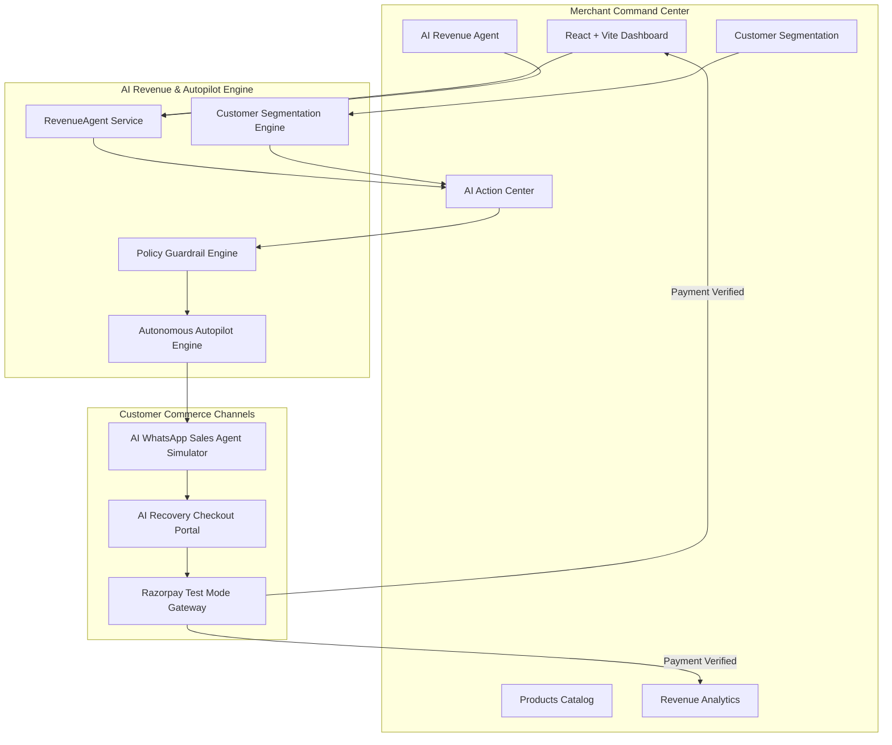

# RazorAgent — AI Revenue Autopilot
**Autonomous Agentic Commerce & Revenue Growth Platform**

Built for the **Razorpay AI Growth & Agentic Commerce Buildathon**.

---

## 1. Project Overview

**RazorAgent** is an enterprise-grade, autonomous agentic commerce platform designed for e-commerce merchants. Acting as an autonomous **AI Revenue Employee**, it follows an end-to-end continuous revenue loop:

$$\text{Understand Business Data} \longrightarrow \text{Find Revenue Opportunities} \longrightarrow \text{Recommend Actions} \longrightarrow \text{Execute Approved Actions} \longrightarrow \text{Track Revenue Impact}$$

### Core Capabilities:
1. **Understands Business Data**: Continuous multi-dimensional analysis of sales, orders, products, customers, carts, AOV, conversion rates, and retention velocity.
2. **Finds Revenue Opportunities**: Discovers high-margin cart leakages, dormant customer segments, and bundle upselling levers.
3. **Recommends Actions**: Formulates structured proposals with estimated revenue impact, business reasoning, and target audience sizing.
4. **Governs Execution**: Enforces merchant approval workflows in the dedicated **AI Action Center** with strict policy guardrails (e.g., maximum 10% discount cap).
5. **Conversational Commerce**: Customer-facing **AI WhatsApp Sales Agent** delivering catalog discovery, price filtering (*"under ₹2,000"*), product cards with 1-click cart addition, and instant checkout.
6. **Converts & Tracks**: Complete flow from discovery to **Razorpay Test Mode** payment verification, immediately updating live revenue metrics.

---

## 2. The 8 Core Pages & Navigation

The platform navigation and routes are cleanly structured into 8 core pages:

| # | Core Page | Route | Description |
|---|---|---|---|
| 1 | **Dashboard** | `/` | 11 Core Metrics, 3 AI Insight Feeds (🔴 Drop, 🟢 Opportunity, 🔵 Completed), ₹18,500 Potential Revenue Detected banner with 1-click campaign launch, and Autopilot Mission Control. |
| 2 | **AI Revenue Agent** | `/ai-agent` | Interactive natural language prompt box, quick query chips (*"How can I increase my revenue this week?"*, *"Why did sales drop yesterday?"*), structured opportunities, and direct promotion to Action Center. |
| 3 | **AI Action Center** | `/action-center` | Full action lifecycle board (`All`, `Suggested`, `Approved`, `Executing`, `Completed`, `Rejected`) with priority badges, revenue impact telemetry, and review modal. |
| 4 | **Customers** | `/customers` | 7 AI Customer Segments (`New`, `Loyal`, `VIP`, `High-Value`, `At-Risk`, `Churned`, `High-Intent`), LTV telemetry, and `[Create Segment Campaign]` modal. |
| 5 | **Products** | `/products` | Catalog inventory management, stock alerts, AOV bundle recommendations, and live modal to add new products. |
| 6 | **WhatsApp Agent** | `/whatsapp-agent` | Conversational commerce rep with smartphone simulator, price filters (e.g. *under ₹2,000*), interactive product cards, `[Add to Cart]`, live cart pill, and checkout link. Includes a clearly labeled **Demo Mode**. |
| 7 | **Orders** | `/orders` | Complete ledger of converted orders, discount applications, and Razorpay Test Mode settlements. |
| 8 | **Analytics** | `/analytics` | Revenue Leakage breakdown, 4-stage conversion funnel, WhatsApp Conversational Commerce ROI, and AOV trends. |

---

## 3. Technology Stack

### Frontend
- **React 18** & **Vite**
- **Tailwind CSS** (Custom Razorpay & WhatsApp dark mode themes)
- **Lucide React** (Icons)
- **Recharts** (Real-time revenue velocity & conversion charts)
- **React Router v6**

### Backend
- **Node.js (ES Modules)** & **Express.js**
- **Dual Database Engine**:
  - **PostgreSQL** (`pg`) via connection string
  - **Persistent Embedded SQL Engine** (Zero-dependency fallback for instant evaluation)
- **JWT Authentication** & **Bcrypt.js**
- **Crypto** (Node.js native HMAC-SHA256 signature verifier)
- **Node.js Native Test Runner** (`node:test`) with 68 passing unit tests

---

## 4. Architecture Diagram



---

## 5. Getting Started

### Prerequisites
- Node.js 18+ (tested on Node.js v22)
- npm

### Installation & Quick Start

1. **Clone the repository:**
   ```bash
   git clone https://github.com/Vedansh5674/RazorAgent.git
   cd RazorAgent
   ```

2. **Install dependencies:**
   ```bash
   npm run install:all
   ```

3. **Start both Backend and Frontend:**
   ```bash
   npm run dev
   ```
   - **Frontend Portal**: http://localhost:5173
   - **Backend API**: http://localhost:5000

4. **Default Merchant Credentials:**
   - **Email**: `admin@trendvault.in`
   - **Password**: `DemoAdmin123!`

5. **Run the Automated Test Suite:**
   ```bash
   cd backend
   npm test
   ```
   *(68 tests across 14 test suites passing with 100% success rate)*

---

## 6. License

This project is licensed under the MIT License - see the [LICENSE](LICENSE) file for details.
