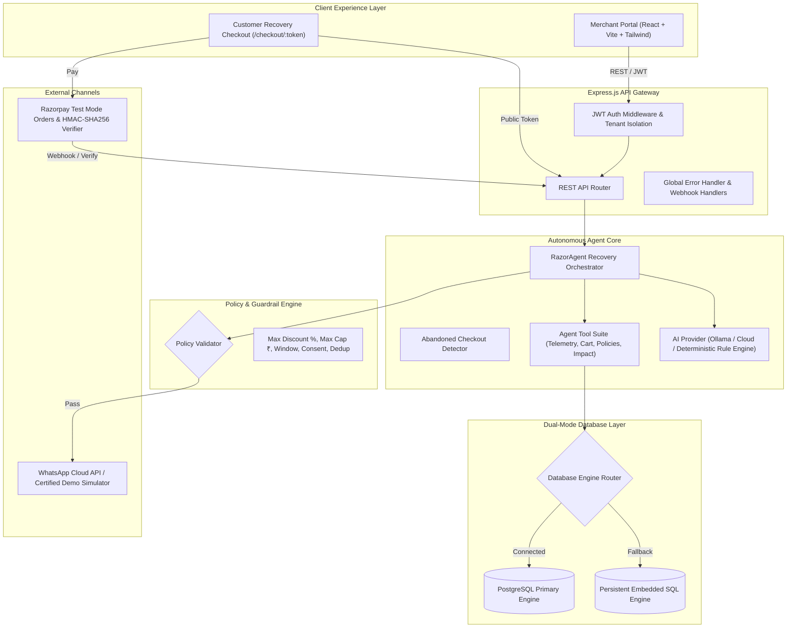

# RazorAgent Architecture Document
**Razorpay AI Growth & Agentic Commerce Buildathon**

## 1. System Overview
**RazorAgent — AI Revenue Autopilot** is an autonomous, agentic commerce solution designed to bridge checkout abandonment leakage with explainable AI reasoning, WhatsApp Business messaging, and Razorpay Test Mode settlements.

---

## 2. Core Subsystems

### 2.1 Autonomous Agent Architecture
The AI Agent operates strictly through a backend **Tool Layer**:
- `getMerchantAnalytics()`: Revenue totals, abandonment rate, payment success rate.
- `getAbandonedCheckouts()`: Gathers unpaid carts and customer consent flags.
- `getCustomerDetails(customerId)`: Retrieval of past orders, LTV, and WhatsApp consent.
- `getCartDetails(cartId)`: Itemized cart pricing and checkout timestamps.
- `getMerchantPolicies()`: Guardrail boundaries configured by the merchant.
- `calculateProjectedImpact()`: Statistical recovery return confidence modeling.
- `createOpportunity()`: Persistence of explainable opportunity record.
- `requestMerchantApproval()`: Human-in-the-loop governance placement.
- `executeApprovedAction()`: Controlled execution of recovery messages.
- `recordAuditEvent()`: Immutable audit log generation.

> **Security Rule**: The AI Agent never talks directly to the database or modifies financial records directly. All parameters are validated by the backend host process.

### 2.2 Dual Database Architecture
To ensure seamless execution in both enterprise production and zero-dependency evaluation environments:
- **Primary**: Native PostgreSQL client (`pg.Pool`) connected via standard `DATABASE_URL`.
- **Fallback**: Persistent embedded SQL storage engine with zero external dependencies, saving state to `data/store.json`. The application detects connectivity at boot time and switches gracefully without throwing errors.

### 2.3 WhatsApp Service & Simulation Sandbox
- Supports Meta Business Cloud API v20.0 with approved template `cart_recovery`.
- Implements strict consent checks (`customer_consents.opted_in`).
- Enforces duplicate prevention to avoid spamming customers.
- Certified Demo Mode with realistic webhook callbacks (`sent`, `delivered`, `read`).

### 2.4 Razorpay Test Mode Payment Pipeline
- Generates test orders using `orders.create` format with paise calculations.
- Verifies authenticity using `HMAC-SHA256` signature verification.
- Converted orders trigger automated opportunity status update, customer LTV recalculation, and audit trail events.
